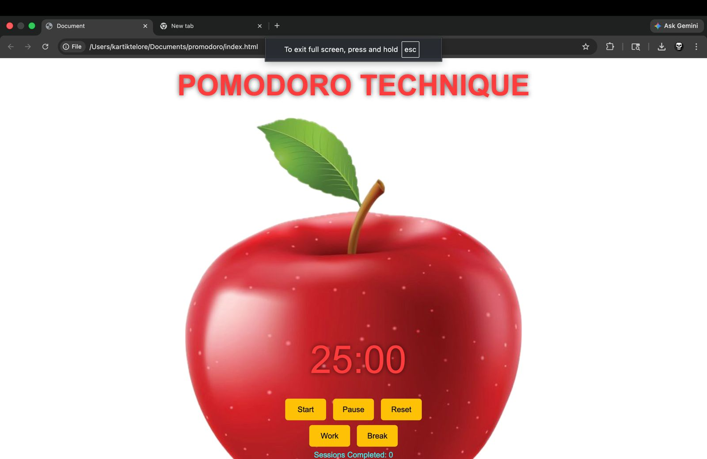

# ⏱️ Pomodoro Productivity Web App

A simple Pomodoro timer built for the ACM Hackathon to help students stay focused and manage time effectively.

---

## 🚀 Features
- 25 min work timer and 5 min break
- Start, Pause, Reset buttons
- Session counter
- Clean UI with alert sound

---

## 🛠️ Tech Stack
- HTML
- CSS
- JavaScript

---

## ▶️ How to Run
Open `index.html` in your browser.

---

## 🎯 Problem Solved
This app helps reduce distraction and improves focus using the Pomodoro technique.

---

## 👤 Author
Amit Solanke  
GitHub: https://github.com/amitsolanke115-netize\
## 📸 App Screenshot

